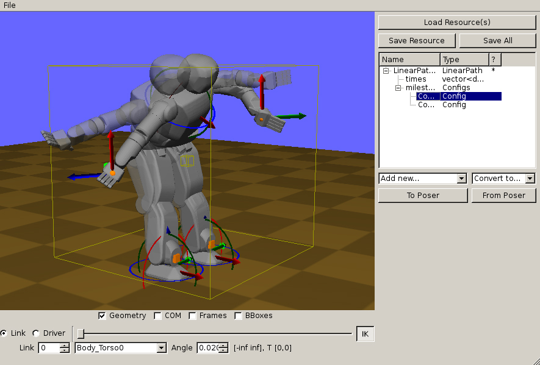

# Klamp't Manual: Running Klamp't apps

`RobotTest` helps inspect/debug robot files and is run from the command line as follows:

```sh
./RobotTest robot_file
```


<center>Above is the RobotTest GUI, showing inverse kinematics posing.  `./RobotTest data/robots/athlete.rob`</center>

`SimTest` performs physics / control simulation and is run from the command line as follows:

```sh
./SimTest [world, robot, environment, or object files]
```


<center>Above is the SimTest GUI.  The transparent
yellow robot is the “poser”. Contact forces are drawn in orange.  `./SimTest data/tx90cups.xml`</center>

(e.g., `./SimTest data/robots/athlete.rob data/terrains/plane.env` or `./SimTest data/hubo_plane.xml`)

`RobotPose` helps a human designer create configurations, constraints, and motions, and is run similarly to SimTest.


<center>Above is the RobotPose GUI.  The 3D coordinate frames are "widgets" for posing links of the robot in Cartesian space.
`./RobotPose data/hubo_plane.xml`. </center>


## Interacting with 3D worlds

Each of the above apps follows a common camera navigation and robot posing interface.

**Navigating**

- Dragging with the left mouse button (left-drag) rotates the camera about a focal point.
- Alt+left-drag zooms the camera.
- Ctrl+left-drag pans the camera.
- Shift+left-drag moves the camera toward and away from the focal point.

**Posing robots**

- Right-clicking on a robot link and dragging up and down will set its desired joint value.
- The floating base of a robot is posed by right-dragging on the widget.
- IK posing
  - To switch to IK-posing mode, check the &quot;Pose by IK&quot; button.
  - In this mode, clicking on a point on the robot will add a new IK point constraint.
  - The widget can be right-dragged to move the robot around.
  - Typing 'c' while hovering over a link will add a new fixed position and rotation constraint.
  - Typing 'd' deletes an IK constraint.

**RobotTest commands**

- 'h' prints the full help.
- 'p' prints the posed configuration to the console.

**SimTest commands (GLUI version)**

- _Command line options_
  - -config [.config file] loads a robot start configuration from disk. If more than one robot exist in the world file, multiple -config options may be specified to give their start configurations.
  - -milestones [.milestone file] loads a milestone path from disk.
  - -path [.xml or .path file] loads a MultiPath or piecewise linear trajectory from disk.
- 'h' prints the full help.
- Typing ' ' (space bar) or clicking the &quot;Go To&quot; (Qt) or &quot;Set Milestone&quot; (GLUI) button will send the posed configuration to the controller.
- Typing 's' or clicking the green arrow (Qt) or &quot;Simulate&quot; (GLUI) button toggles the simulation.
- Typing 'a' advances by one simulation step (1/100 s).
- Clicking the red circle (Qt) or the &quot;Save movie&quot; button (GLUI) will tell the simulator to start saving 640x480 frames to PPM files on disk at 30fps. These can be converted into a simulation-time (i.e., 1s of movie time = 1s of simulated time) movie using a utility such as ffmpeg.  In Qt, the movie-making command and output file can be edited by selecting &quot;Change Encoder...&quot; and &quot;Change file...&quot; from the &quot;Record&quot; menu, respectively.  The resolution can also be set from the &quot;Record&quot; menu. In GLUI, the movie-making command must be executed manually, and the movie resolution can be changed by setting the movieWidth and movieHeight parameters in settings (JSON format).
- Clicking the red spring icon (Qt) or typing 'f' (GLUI) toggles force application mode. In force application mode, right-clicking and dragging on the robot will apply a spring-like force between the robot and the cursor position.
- The &quot;Save View&quot; (Qt) or typing lowercase 'v' (GLUI) saves the current viewport to disk, and &quot;Load View&quot; (Qt) or typing uppercase 'V' (GLUI) loads the previously saved viewport. This is useful for creating side-by-side comparison videos.

_Note_: when simulating a path, Klamp't will only issue a &quot;discontinuous jump requested&quot; warning if the path does not start from the robot's current configuration. If you wish to initialize the robot with the start of the path, either copy the start configuration into the world file, or provide the -config [file] command line argument. To easily extract a start configuration from a MultiPath file, use the script `python Python/multipath.py -s [path.xml] > temp.config`.

**RobotPose commands**

- _Command line options_
  - `-l [resource_library directory or XML file]` loads a resource library from disk. Multiple libraries can be loaded in this way.
- Individual resources or resource libraries may be loaded / saved from disk via the &quot;Load [X]&quot; / &quot;Save [X]&quot; buttons at the top.
- Qt Version:
  - Resources in the resource tree can be expanded, dragged, and copied (Shift+drag) using the mouse.
  - The status indicators in the resource tree are as follows:
    - \* indicates that the resource has been modified since loading.
    - @ indicates that sub-resources have been modified, and RobotPose has not yet merged the modifications into the top-level resource.  (Click on the top-level resource to attempt the merge)
    - ! indicates that a prior merge was unsuccessful. For example, a Linear Path may not have the same number of times as configurations. Correct the error and try again.
  - The &quot;Add Resource...&quot; dropdown allows creating new resources.
  - The &quot;Convert to...&quot; dropdown allows resources to be converted to similar types.
  - &quot;To poser&quot; sends the currently selected resource to the poser. Works with &quot;Config&quot;, &quot;IKGoal&quot;, &quot;Hold&quot;, and &quot;Stance&quot;.
  - &quot;From poser&quot; overwrites the currently selected resource using its value in the poser. Works with &quot;Config&quot;, &quot;IKGoal&quot;, &quot;Hold&quot;, and &quot;Stance&quot;.
  - When Configs, Linear Path, or MultiPath resources are selected: &quot;Optimize Path&quot; generates and optimizes a trajectory along the currently selected resource, minimizing execution time under the robot's velocity and acceleration bounds.
- GLUI Version:
  - &quot;Library -&gt; Poser&quot; sets the poser to use the currently selected configuration, stance, hold, or grasp from the resource library.
  - &quot;Poser -&gt; Library&quot; stores the current posed configuration, stance, or hold to the resource library. Selection is accomplished via the &quot;Resource Type&quot; selector.
  - &quot;Library Convert&quot; converts the currently selected resource into a resource of the specified type in the &quot;Resource Type&quot; selector.
  - &quot;Create Path&quot; generates an interpolating path and saves it to the resource library. If the currently selected resource is a Config type, it interpolates from the poser's current configuration to the resource. If a Configs resource is selected, then it interpolates amongst the configurations in the file.
  - &quot;Optimize Path&quot; generates and optimizes a trajectory along the currently selected resource, minimizing execution time under the robot's velocity and acceleration bounds. This works when Configs, Linear Path, or MultiPath resources are selected.
  - _Note:_ path editing is not particularly sophisticated due to the limitations of GLUI. The best way of generating a sophisticated path inside RobotPose is to generate keyframes into a Configs resource, and choose &quot;Create Path&quot; or &quot;Optimize Path&quot;.

## Example files

World files for different robots and problem setups are available in the Klampt/data subdirectory:

- `hubo\*.xml`: the KAIST Hubo humanoid.
- `puma\*.xml`: the Puma 760 industrial robot.
- `tx90\*.xml`: the Staubli TX90L industrial robot.
- `baxter\*.xml`: the Rethink Robotics Baxter robot.

Other test robots, objects, and environments are available in the `Klampt/data/{robots,objects,terrains}` subdirectories. Some files of interest may include:

- athlete.rob: the NASA ATHLETE hexapod (incomplete, missing wheel geometry).
- atlas.rob: the Boston Dynamics ATLAS robot.
- cartpole.rob: a cart-pole balancing control problem.
- footed\_2d\_biped.rob: a simple 2D biped mimicking a human's forward motion.
- footed\_2d\_monoped.rob: a simple 2D monoped.
- hrp2.rob: the AIST HRP-2 humanoid
- pr2.rob: the Willow Garage PR2 robot (requires KrisLibrary to be built with Assimp support)
- robonaut2.rob: the NASA Robonaut2 humanoid torso.
- robotiQ\_3finger.rob: the RobotiQ 3-finger Adaptive Gripper.
- simple\_2d\_biped.rob: a simple 2D biped mimicking a human's lateral motion.
- swingup.rob: a simple pendulum swingup control problem.
- plane.env: a flat plane environment
- block.obj: a 40cm block
- block\_small.obj: an 8cm block

Test motions are available in the `Klampt/data/motions` directory. Simulation examples can be run via:

- `./SimTest data/robots/athlete.rob data/terrains/plane.env -config data/motions/athlete_start.config -path data/motions/athlete_flex.xml`
- `./SimTest data/hubo_table.xml -path data/motions/hubo_table_path_opt.xml`
- `./SimTest data/hubo_stair_rail.xml -path data/motions/hubo_stair_rail_traj.xml`

## Klamp't Utilities

Klamp't also comes with the following utility apps:

- `URDFtoRob` produces a Klamp't .rob file from a Unified Robot Description Format (URDF) file. 
- `MotorCalibrate` generates motor simulation parameters given example commanded and sensed trajectories. 

- `Unpack` expands a composite resource into a hierarchical directory structure containing its components.  These components can be individually edited and then re-combined into the resource using `Pack`.

- `Pack` is the reverse of `Unpack`, taking a hierarchical directory structure and combining it into a composite resource of the appropriate type.

- `Merge` combines multiple robot and object files into a single robot file.

- `SimUtil` is a command line interface to the simulator.

## URDFtoRob

`URDFtoRob` produces a Klamp't .rob file from a Unified Robot Description Format (URDF) file. Settings for geometry import/export can be changed by editing urdftorob.settings.

 Klamp't-specific parameters (e.g., ignored self collisions, servo gains) are given default values. To change these parameters, the .rob file must be edited or the `<klampt>` element may be edited as described in Section Error: Reference source not found.

To clean up extraneous self-collision checks, the "Print Self Collisions" button of the RobotPose program can be used. The MotorCalibrate program may be run to fix up the servo gain and friction parameters.


## MotorCalibrate

`MotorCalibrate` generates motor simulation parameters given example commanded and sensed trajectories.  It runs a quasi-Newton optimization with random restarts to match the simulated values to the sensed parameters as closely as possible.

To use it, first run it without arguments to generate a blank settings file. Edit the parameters to set the robot, driver indices to estimate, whether any links are rigidly fixed in space, and the commanded / sensed path files (in Linear Path format).  Then run it again with the settings file as input, and it will output the optimized parameters to the console.  These latter lines (beginning with `servoP`) should be copied into the .rob or .urdf file.

An example optimization is given by running

```
./MotorCalibrate Examples/motorcalibrate_baxter.settings.
````

Multiple runs of this process, possibly with different initial conditions, should generate better matches to the sensed data.


## Example C++ programs

Klamp't also contains several example applications in `Klampt/Examples`:

- `Cartpole` demonstrates generation of optimal control tables for two toy dynamic systems - a pendulum swing-up and a cart-pole balancing task.
- `PlanDemo` is a command line kinematic motion planner for collision-free motion between configurations.
- `ContactPlan` is a command line kinematic motion planner for collision-free, stable motion in contact between configurations.
- `RealTimePlanning` demonstrates real-time planning between randomly generated target configurations.
- `UserTrials` is a demonstration of Klampt's real-time planning capabilities. A similar program was used for the user studies in E. You and K. Hauser. _Assisted Teleoperation Strategies for Aggressively Controlling a Robot Arm with 2D Input_. In proceedings of Robotics: Science and Systems (RSS), Los Angeles, USA, June 2011.