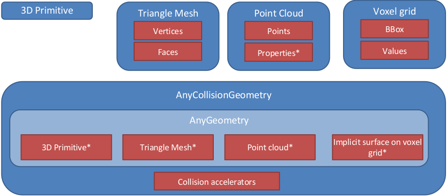

# Klamp't Manual: Geometry and Appearance

Klamp't uses a variety of geometry types to define geometric primitives, triangulated meshes, and point clouds.  Each geometry may also be associated with an [Appearance](#appearance).

## Geometries and collision geometries
Klamp't stores Geometry datain an object's local frame.

The notion of a _collision geometry_ combines some underlying geometric data with transformations and collision acceleration structures. Collision geometries have a _current transformation_ that sets where they exist in space, and is used for collision testing. Collision geometries also support an additional, nonnegative margin setting that &quot;expands&quot; the underlying geometry when performing collision testing.  The margin does not actually affect the geometric data, but rather it changes the distance threshold that is used to consider colliding vs. noncolliding geometries.

### Geometric operation support

The following geometries are currently supported:
- _Triangle meshes_: complete, optimized, and well-tested.
- _Point clouds_: nearly complete support.
- _Geometric primitives_: nearly complete support. 
- _Implicit surface volume grids_: experimentally supported.  However, the implementation is incomplete at the moment.

The following operations are supported:
- _Drawing_: All types supported.
- _Collision detection in planning_. All types supported. Note: Point cloud collision detection is currently inefficient for large point clouds.
- _Tolerance verification_. All types supported. Note: Point cloud collision detection is currently inefficient for large point clouds.
- _Distance detection in planning_.  primitive/primitive and triangle mesh/triangle mesh distance functions are available.
- _Ray casting_. Triangle meshes, point clouds.
- _Contact detection in simulation_. Triangle mesh / triangle mesh and triangle mesh / point cloud only.

### Geometry caching

When multiple objects load the same geometry file, Klamp't uses a caching mechanism to avoid reloading the file from disk and re-creating collision acceleration structures. This is essential for loading very large scenes with many replicated objects. However, when geometries are transformed by API calls, they are removed from the cache. So, to achieve maximum performance with many duplicated geometries, it is recommended to transform the geometry files themselves in advance rather than dynamically through the API.

### C++ API

Geometry data is stored in the `AnyGeometry3D` type and collision geometries are stored in the `AnyCollisionGeometry3D` type. These are essentially container types that abstract the underlying geometry and collision acceleration data structures. To operate on the data therein, users will need to inspect the geometry's type and cast to the appropriate type. Detailed documentation can be found in the following files:

- KrisLibrary/math3d/geometry3d.h defines 3D geometric primitives, including `Point3D`, `Segment3D`, `Triangle3D`, `AABB3D`, `Box3D`, `Sphere3D`, and `Ellipsoid3D`.  There is also a `GeometricPrimitive3D` class that abstracts common operations on any geometric primitive.
- KrisLibrary/meshing/TriMesh.h defines 3D triangle meshes.
- KrisLibrary/meshing/PointCloud.h defines a 3D point cloud. Each point may contain a variety of other named properties, including color, normal, id, etc.
- KrisLibrary/geometry/CollisionMesh.h contains the `CollisionMesh` and `CollisionMeshQuery` data structures. `CollisionMesh` overloads the `Meshing::TriMeshWithTopology` class and represents a preprocessed triangle mesh for collision detection. It can be rigidly transformed arbitrarily in space for making fast collision queries via the `CollisionMeshQuery` class and the `Collide`/`Distances`/`WithinDistance` functions. Mesh-mesh proximity testing (collision and distance computation) are handled by the open source PQP library developed by UNC Chapel Hill. These routines are heavily tested and fast.
- KrisLibrary/geometry/AnyGeometry.h defines the `AnyGeometry3D`, `AnyCollisionGeometry3D`, and `AnyCollisionQuery` classes.  It is recommended to use these classes for geometric operations because they are abstract and may be extended to handle more geometry representations in the future.

### Python API

The [Geometry3D](http://motion.pratt.duke.edu/klampt/pyklampt_docs/classklampt_1_1robotsim_1_1Geometry3D.html) class in the `klampt` module allows collision testing between geometries.  All the standard Klamp't geometry types (geometric primitives, triangle meshes, point clouds) are supported. Prototypes and documentation are defined in [klampt/src/geometry.h](../Python/klampt/src/geometry.h).

For convenience, the [klampt.model.collide](http://motion.pratt.duke.edu/klampt/pyklampt_docs/namespaceklampt_1_1model_1_1collide.html) module provides utility functions for checking collision with sets of objects, as well as a `WorldCollider` class that by checks collision between any set of objects and any other set of objects. These methods return an iterator over collision pairs, which allows the user to either stop at the first collision or enumerate all collisions. The following `WorldCollider` methods are used most often:

- `collisions()`: checks for all collisions.
- `collisions(filter)`: checks for all collisions between objects for which filter(obj) returns True
- `collisions(filter1,filter2)`: checks for all collisions between pairs of objects for which filter1(objA) and filter2(objB) both return True
- `robotSelfCollisions`, `robotObjectCollisions`, `robotTerrainCollisions`, `objectObjectCollisions`, and `objectTerrainCollisions` check collisions only between the indicated robots/objects/terrains.
- `rayCast(s,d)`: performs ray casting against objects in the world and returns the nearest collision found.

## Appearance

TODO