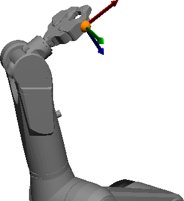
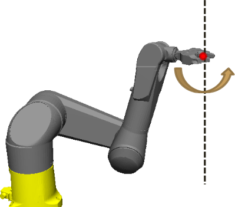
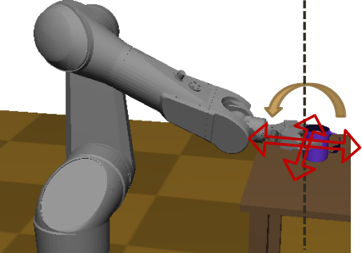
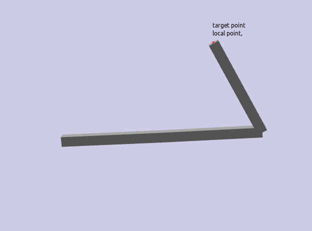
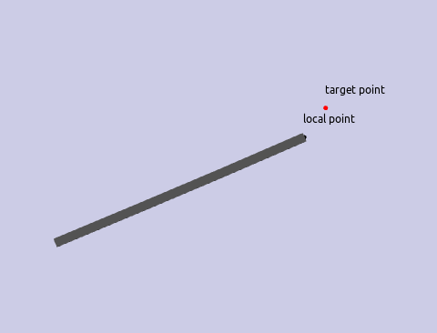

# Klamp't Manual: Inverse Kinematics 

There are two components that need to be set up to solve inverse kinematics problems. 
- First, an **[IK Objective](#ik-objective)** object must to be configure to define constraints on a constrained link.  
- Next, the **[IK Solver](#ik-solver)** is set up and called to find a configuration so that the transformations satisfy the constraints specified by the objectives. 

Multiple links can be constrained to different targets by creating several IK Objectives and passing these to the solver.

## IK Objective

An IK Objective defines a target in Cartesian world space coordinates that you want to achieve with a link of the robot.
Each IK Objective's constraint is specified to match some local coordinates on the link to some target coordinates, and can include both position and orientation. 

An objective contains:
- A link index
- A rotation constraint type: none, axial, fixed
- A position constraint type: none, planar, linear, fixed
- For non-none constraints, a local position and a target position
- For planar and linear constraints, a direction of the plane/line
- For non-none constraints, a target rotation
- For axial constraints, a rotation axis

Klamp't also supports relative IK Objectives that let you define a constraint from coordinates on one link relative to another on the same robot, but these are used less frequently. The main use case for these objectives is to perform multi-handed manipulation of a single object.  Relative objectives are specified by giving:
- a destination link index.  (By default -1, which means destination is in the world frame.)


### Usual Objective Types

| Constraint type  |  Point | Fixed | Hinge | Surface | 
| -----------------|--------|-------|-------|---------|
| Position         | fixed  | fixed | fixed | planar  |
| Rotation         | none   | fixed | axis  | axis    |
| Constrained dims | 3      | 6     | 5     | 3       |
| Useful for       | Point feet or fingers | Grasps, flat feet | Grasping cylindrical objects | Placing objects down with unspecified position and orientation|
|                  | |  |  |  |

The SimTest and RobotPose programs only support point and fixed constraint types. More exotic types must be created in code.

### C++ API

IK Objectives are equivalent to the `IKGoal` class implemented in KrisLibrary/robotics/IK.h.  Its `link` member must be filled out prior to use and indicates the link's index on its robot.  If the constraint is meant to constrain the link to a target link on the robot (rather than the world), then the `destLink` member should be filled out.  By default, `destLink` is  -1, indicating that the target is in world coordinates.

**Easy setup.** For convenience, the `SetFromPoints` method is provided to map a list of local points to a list of target space points. This function covers most typical IK constraints. If there is a single point, the constraint is a fixed point constraint. If the points are collinear, the constraint is an edge constraint. If the points span a plane, the constraint is a fixed constraint.

**Detailed setup.** Position constraints are defined by the `localPosition`, `endPosition`, and optionally the `direction` members. There are four types of position constraint available.

- `Free`: no constraint
- `Planar`: the point is constrained in one dimension, i.e., to lie on a plane. Here `endPosition` refers to a point on the plane and `direction` refers to the plane normal.
- `Linear`: the point is constrained in two dimensions, i.e., to lie on a line. Here `endPosition` refers to a point on the line and `direction` refers to the line direction.
- `Fixed`: the point is constrained to a fixed point. Here `endPosition` refers to that point and `direction` is ignored.

Rotation constraints are defined by the `endRotation` and optionally the `localAxis` members. There are three types of rotation constraint available.

- `Free`: no constraint
- `Axis`: rotation is constrained about an axis. The direction localAxis maps to the `endRotation` direction. These must be unit vectors.
- `Fixed`: rotation is fixed. The `endRotation` member is a `MomentRotation` that represents the fixed orientation. To convert to a 3x3 matrix, call the `GetFixedGoalRotation` method. To convert from a 3x3 matrix, call the `SetFixedRotation` method.


### Python API

The core functionality is contained in the [IKObjective](http://motion.pratt.duke.edu/klampt/pyklampt_docs/classklampt_1_1robotsim_1_1IKObjective.html) class (klampt/src/robotik.h), but there are more convenient methods in the [klampt.model.ik](http://klampt.org/pyklampt_docs/ik_8py.html) module.  The following assume that you have first run

```python
from klampt import *
from klampt.model import ik
```

#### Constructors
- `obj = ik.objective(body, ref=None, local=lplist, world=wplist)`: creates an `IKObjective` that constrains some local points on body (usually a RobotModelLink) to world points. lplist is either a single 3d point or a list of 3d points.  wplist taks the same format as lplist, and if it is a list of points, it needs to be of the same length.
- `obj = ik.objective(body, ref=None, R=R, t=t)`: creates an `IKObjective` that constrains a body (usually a `RobotModelLink`) so its frame has a fixed rotation R and translation t.
- `obj = IKObjective()`: manual constructor
- `obj.setFixedPoint(link,lp,wp)`: creates a point constraint on the link indexed by link. lp and wp are the 3D local and world points.
- `obj.setFixedPoints(link,lplist,wplist)`: creates a point constraint on the link indexed by link. lplist and wplist  are lists of local and world points.
- `obj.setFixedTransform(link,R,t)`: creates a fixed constraint on the link indexed by link so its frame has the fixed rotation R and translation t.

#### Accessors
- `obj.num[Pos/Rot]Dims()`: returns the number of positions of position / orientation constrained (0-3)
- `obj.getPosition()`: returns a pair (local,world) of the constrained position. For fixed constraints local is the origin [0,0,0] and world is the target point.
- `obj.getPositionDirection()`: if the position has a planar constraint (numPosDims()=1), the normal direction of the plane. If this is an linear constraint (numPosDims()=2), the direction of the line
- `obj.getRotation()`: if the rotation is fixed (numRotDims()=3), the rotation matrix R.
- `obj.getRotationAxis()`: if the rotation is axial (numRotDims()=2) returns a pair (laxis,waxis) giving the local / world coordinates of the constrained axis.
- `obj.getTransform()`: if this is a fixed constraint, returns the pair (R,t) giving the fixed transform of the link

#### Convenience methods
- `obj = ik.fixed_objective(body, ref=None, local=None, world=None)`: creates an IKObjective that fixes the RobotModelLink in its current location and orientation.
- `obj = ik.fixed_objective(body, ref=None, local=lp, world=None)`: creates an IKObjective that fixes the local point lp on the RobotModelLink in its current location.
- `obj = ik.fixed_objective(body, ref=None, local=None, world=wp)`: creates an IKObjective that fixes the world point wp on the RobotModelLink in its current location.
- `obj = ik.fixed_rotation_objective(body, ref=None, local_axis=None, local_axis=None)`: creates an IKObjective that fixes the RobotModelLink in its current orientation.


## IK Solver

Klamp't contains a numerical IK solver. Numerical inverse kinematics solvers are extremely flexible and can solve for arbitrary combinations of IK constraints. They take the robot's current configuration as a starting point and run a descent technique to (hopefully) solve all constraints simultaneously. 
It also takes optional joint limits and subsets of active DOFs.

Input
- Robot model
- One or more IK objectives
- Seed configuration is given as the model's current configuration
- Tolerance on max constraint error
- Maximum iteration count
Optional input:
- sub-select active DOFs (default uses all ancestors of constrained links)
- custom joint limits
- "bias configuration" for redundant robots

Output:
- Success or failure (i.e. did not achieve desired tolerance)
- Solution configuration is returned inside Robot Model

Specifically, the solver performs Newton-Raphson root solving, with line search (never diverges).  These routines automatically try to optimize only over the relevant variables, e.g., if the only constraint is on the robot's right foot, then the arms, head, and left leg will not be included as optimization variables.

_Important_: To use the solver properly, you must understand the configuration of the Robot Model is crucial to this process.  First, it provides the seed configuration to the solver.  Second, it provides default joint limits.  Third, the output configuration of the solver is given inside the Robot Model.

IK solvers can also be queried for the IK *constraint residual* and the *constraint Jacobian*.  These stack the constraint errors of each objective, and can help you debug whether the solver has successfully converged, or whether your objectives were defined incorrectly.

### C++ API


_C++ API_. The SolveIK() functions in KrisLibrary/robotics/IKFunctions.h are the easiest way to solve IK constraints. For richer functionality, consult the documentation of the RobotIKFunction and RobotIKSolver classes and Get\*Dofs() functions.


### Python API

The solver code is contained in the [IKSolver](http://motion.pratt.duke.edu/klampt/pyklampt_docs/classklampt_1_1robotsim_1_1IKSolver.html) class (klampt/src/robotik.h), but there are more convenient methods in the [klampt.model.ik](http://klampt.org/pyklampt_docs/ik_8py.html) module.

- `ik.solve(objectives,iters=1000,tol=1e-3,activeDofs=None)`:  Solves one or more IK objectives with the given max iteration count iters and constraint tolerance tol.  Returns True if successful. Seeded by the robot's current configuration, and on output the robot is set to the best found configuration.  A list of active DOFs can be provided.
- `solver = ik.solver(objectives)`: creates a solver for the given (one or more) objectives.
- `solver = IKSolver(robot)`: creates a solver for the given robot model.
- `solver.add(objective)`: adds another IKObjective to the solver.
- `solver.setActiveDofs(dofs)`: sets the active DOFs, given as a list of integer indices (default: all ancestor links of the constrained links).
- `solver.getActiveDofs()`: gets the active DOFs as a list of integer indices.
- `solver.setJointLimits(qmin,qmax)`: sets custom joint limits, each a list of NL limits (default: solver uses the robot model's joint limits).
- `solver.sampleInitial()`: generates a random configuration as the seed.
- `solver.get/setMaxIters(iters)`: gets/sets the maximum number of iterations allowed per solve call.
- `solver.get/setTolerance(tol)`: gets/sets the convergence tolerance for the solver (default 1e-3).
- `solver.solve()`: solves for the current set of IK objectives and iteration / tolerance settings. Returns True if successful.
- `solver.lastSolveIters()`: returns the number of iterations used in the last solve() call.
- `solver.getJacobian()/ik.jacobian(objectives)`: returns the matrix of IK objective derivatives with respect to the active DOFs.
- `solver.getResidual()/ik.residual(objectives)`: returns the vector of IK objective values at the robot's current configuration.

Convenience functions:
-   `python
    ik.solve_global(objectives, iters=1000, tol=1e-3, activeDofs=None,
                numRestarts = 100, feasibilityCheck = None, startRandom = False )
    `
    Solves one or more IK objectives in a global manner with a random-restart technique.  The first 4 arguments are the same as ik.solve.  numRestarts gives the number of total restarts attempted before failure is declared.  If feasibilityCheck is given, it is a zero-argument function that returns True if the robot's current configuration is feasible.If startRandom = True, then the robot's configuration is randomized on the first iteration.
-   `python
    ik.solve_nearby(objectives, maxDeviation,
                iters=1000, tol=1e-3, activeDofs=None,
                numRestarts = 0, feasibilityCheck = None )       
    `
    Solves one or more IK objectives while preventing the robot's current configuration from deviating more than maxDeviation along each axis. 


### Example

Find a configuration where the end effector of a planar 3R robot touches the point (1.5,0,1).  Let us start doing this in a naive manner:

```python
>>> from klampt import *
>>> from klampt.model import ik
>>> world = WorldModel()
>>> world.loadElement("data/robots/planar3R.rob")
...
>>> robot= world.robot(0)
>>> link = robot.link(2)
>>> print robot.getConfig()
[0.0, 0.0, 0.0]
>>> obj = ik.objective(link,local=[1,0,0],world=[1.5,0,1])
>>> solver = ik.solver(obj)
>>> solver.solve()
False
>>> robot.getConfig()
[0.0, 0.0, 4.215773454225064]
>>> print solver.getResidual()
[0.023547356775342587, 0.0, -0.12079986421507116]
```

So why did this fail?  Well, the joint limits on the robot don't allow clockwise rotation from the 0 configuration, so the solver fell into a local minimum where the first two joints are at their lower limit.  The solver isn't that smart about the Robot Joint type, which is a spin joint, which should theoretically have no limits.  So, one solution is to turn off the limits, like so:

```
>>> solver.setJointLimits([],[])  #the values [],[] tell the solver to turn off joint limits
>>> robot.setConfig([0,0,0])
>>> solver.solve()
True
>>> print robot.getConfig()
[6.2210827440574805, 6.275852672978871, 4.263178112891824]
>>> print solver.getResidual()
[-4.36569416761845e-06, 0.0, -2.3191920574427982e-05]
```

Another rationale is that the initial seed configuration as not chosen well, and a different choice of initial seed might have led to a global minimum.  A simple approach for doing this is is to use *random restarts*, one iteration of which is shown as follows:
```
>>> solver.setJointLimits(*robot.getJointLimits())    #reinstantiate joint limits
>>> solver.sampleInitial()   # the initial configuration didn't let the solver find a solution, sample a new one
>>> solver.solve() 
True
>>> print robot.getConfig()
[0.9280844225663805, 5.24982420453923, 2.3118916002271988]
>>> print solver.getResidual()
[-4.36569416761845e-06, 0.0, -2.3191920574427982e-05]
```

We can visualize the result as follows:
```python
>>> from klampt import vis
>>> vis.add("world",world)    #shows the robot in the solved configuration
>>> vis.add("local point",link.getWorldPosition([1,0,0]))
>>> vis.setAttribute("local point","type","Vector3")  #usually the vis module identifies a Config vs a Vector3, but this robot has exactly 3 links
>>> vis.add("target point",[1.5,0,1])
>>> vis.setAttribute("target point","type","Vector3")
>>> vis.setColor("target point",1,0,0)  #turns the target point red
>>> vis.show()  #this will pop up the visualization window until you close it
```


Now suppose we were to change the world position to an unreachable point. The sum of the robot link lengths is 3, so the world position (3,0,1.5) is certainly out of reach. Running the following code, we get that the solver returns False, and the robot is placed at a configuration that reaches almost as close as possible to the target:

```python
>>> obj2 = ik.objective(link,local=[1,0,0],world=[3,0,1.5])
>>> solver = ik.solver(obj2)
>>> solver.setJointLimits([],[])
>>> robot.setConfig([0,0,0])
>>> solver.solve()
False
>>> print robot.getConfig()
[5.88713697296476, 6.278604588847693, 6.274884577272825]
>>> print solver.getResidual()
[-0.2390446069453609, 0.0, -0.32659917185852283]
>>> print link.getWorldPosition([1,0,0])
[2.760955393054639, 0.0, 1.1734008281414772]
```

Running the visualization code again, we get something like this:



